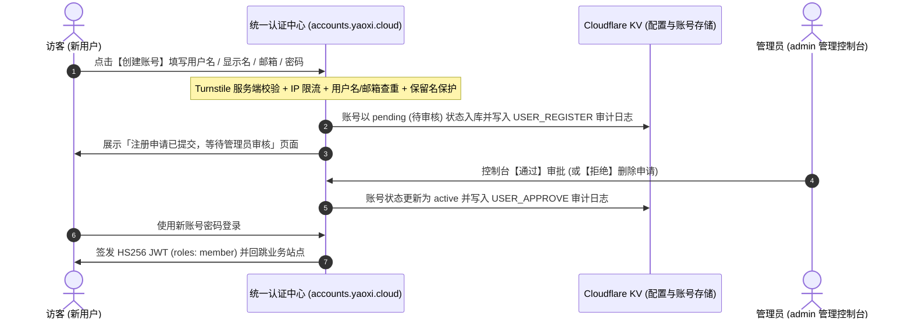
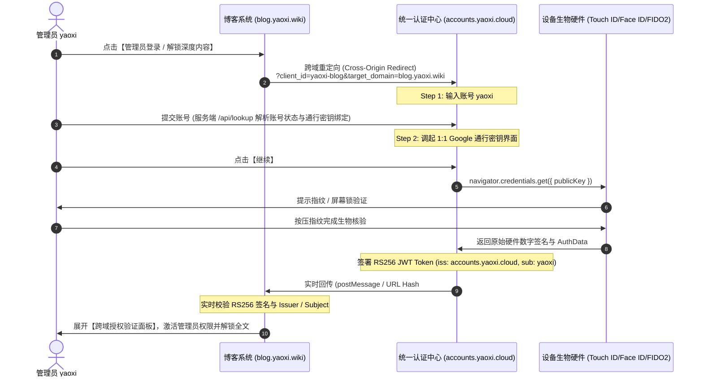

# accounts.yaoxi.cloud 统一身份认证中心

基于 **OAuth 2.0 / OIDC 协议** 与 **FIDO2 / WebAuthn 通行密钥 (Passkey)** 规范打造的生产级统一身份认证系统。1:1 像素级复刻 Google Identity v3 (Material 3) 登录交互与视觉体系。

---

## 🌟 核心特性与架构升级

- **泛域名全面支持**: 支持 `*.yaoxi.wiki` 与 `*.yaoxi.cloud` 全子域，任何携带合法防伪凭证的子域均可无缝拉起登录。
- **零前端调试干扰**: 移除开发期 JWT 数据流、Base64 串与倒计时；错误状态采用标准 Google 400 简洁提示，不暴露任何内部安全参数。
- **开放自助注册 (审核制)**: 登录页「创建账号」支持访客自助注册（用户名/显示名/邮箱/密码），由管理后台「开放自助注册策略」控制总开关与审核模式（默认需管理员审核）；Turnstile 服务端 siteverify + KV IP 限流防批量滥用，账号默认角色 `member`，待审核账号需管理员在控制台一键「通过」后方可登录。
- **用户目录隐私加固**: 公开配置接口不再下发任何账号清单 (含邮箱)；登录首步改为服务端 `/api/lookup` 账号解析，仅返回掩码邮箱与最小必要状态信息，杜绝已注册用户邮箱清单被任意访客拉取。
- **开箱即用 SDK (`sdk/yaoxi-auth.js`)**: 类似 Google 登录 SDK，支持 Popup 弹窗 (1060x620) 与 Redirect 跳转两种接入方式，自动监听 postMessage 跨域回传。
- **个人账号个性化平台凭据下发**: 支持在管理后台为指定账号绑定 GitHub PAT、Cloudflare API Token 等平台凭据，在用户授权登录时随 JWT Claims 与 Token Bundle 一同安全下发给受信任客户端，供客户端无缝调取第三方开放平台能力。
- **1:1 Google Material 3 宽屏卡片**: 1040px 双栏卡片结构、Material 3 浅蓝提示横幅、浮动边框输入框与右下角标准按钮。

---

## 📁 项目文件架构

```text
yaoxi-account/
├── index.html                 # 🏛️ 统一登录中心首页 (1:1 Google Material 3)
├── accounts-login.html        # 独立登录入口 (与 index.html 同步)
├── accounts-login.css         # Google 官方 1040px 双栏卡片、提示条与控件样式
├── accounts-login.js          # 核心认证逻辑、密码学签名核验、动态配置加载
├── admin.html                 # 🎛️ Google Admin 控制台 (后台可视化管理所有功能数据)
├── admin.css                  # 后台管理控制台 Material 3 响应式设计系统
├── admin.js                   # 后台全量 CRUD 逻辑、配置持久化与审计监控
├── functions/
│   ├── _middleware.js         # Cloudflare Pages 边缘中间件 (严格白名单 + 泛域名 400 校验)
│   └── api/
│       ├── config.js          # 统一配置存储与 KV 持久化 API (/api/config)
│       ├── login.js           # 服务端密码核验与 JWT 签发 API (/api/login)
│       ├── status.js          # 账号实时状态查询与吊销检测 API (/api/status)
│       ├── register.js        # 开放自助注册 API (/api/register)
│       └── lookup.js          # 服务端账号解析 API (/api/lookup)
├── cloudflare-worker-400.js   # 备用 Cloudflare Worker 边缘拦截器
├── sdk/
│   ├── yaoxi-auth.js          # 统一认证客户端接入 SDK (UMD/ESM/Browser)
│   └── README.md              # 📖 SDK 官方接入指南 (架构/API/Vue/React/博客接入实战)
├── client-blog.html           # 博客接入演示页面 (展示 SDK 跨域握手与回传)
├── push_to_github.sh          # 🚀 GitHub 快速推送脚本
└── README.md                  # 架构说明与集成文档
```

---

## 📦 官方 SDK 接入指南 (SDK Documentation)

> 💡 **详细接入指引已独立成册，请查阅完整官方文档：[sdk/README.md](./sdk/README.md)**

YaoxiAuth SDK 提供了类似于 Google Identity Services (GSI) 的开箱即用集成体验：

- 🚀 **极速接入**: 1 行 CDN 脚本或 npm 引入，3 分钟跑通登录流程。
- 🪟 **双交互模式**:
  - **Popup 模式 (推荐)**: 居中拉起 1060×620 浮动认证窗口，通过 `postMessage` 零跳转回传，保持当前阅读状态。
  - **Redirect 模式**: 经典全页跳转，URL Hash (`#access_token=...`) 安全回传。
- 🛡️ **实时状态监控**: 内置 `watchAccountStatus()` 心跳与切屏监听，当用户在后台被冻结时，全端毫秒级同步下线与销毁凭证。
- 💻 **全框架支持**: 提供 Vanilla JS、Vue 3 (Composition API)、React、Hexo/Hugo 博客实战范例。

---

## 📝 开放自助注册流程 (Open Registration)



> 管理员可在控制台「账号与凭证 → 开放自助注册策略」随时开关自助注册入口与审核模式（关闭审核时注册即自动激活并直接完成登录握手）。

---

## 🔄 认证时序与跨域流程



---

## 🔑 生产签发 JWT 载荷示例 (Token Claims)

```json
{
  "iss": "https://accounts.yaoxi.cloud",
  "aud": "yaoxi-blog",
  "sub": "yaoxi",
  "name": "yaoxi",
  "email": "yaoxi@yaoxi.cloud",
  "email_verified": true,
  "roles": ["admin", "author", "super_user"],
  "scope": "openid profile email admin",
  "amr": ["passkey", "fido2", "hw_biometrics", "fingerprint"],
  "platform_tokens": {
    "github": "ghp_xxxxxxxxxxxxxxxxxxxx",
    "cloudflare": "cf_token_xxxxxxxxxxxx"
  },
  "passkey_proof": {
    "authType": "webauthn_passkey_assertion",
    "signature": "verified"
  },
  "iat": 1787288400,
  "exp": 1787295600,
  "token_type": "Bearer"
}
```

---

## 🚀 本地实时测试与访问

```bash
# 启动本地服务
python3 -m http.server 8080 --directory /mnt/sdcard/google-login-ui
```

- 🏛️ **[accounts.yaoxi.cloud 认证中心](http://localhost:8080/accounts-login.html)**
- 🌐 **[blog.yaoxi.wiki 博客客户端系统](http://localhost:8080/client-blog.html)**
